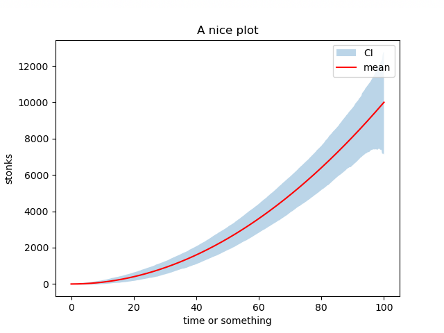

# stegaplots
Making plots while experimenting with an idea is very fun. Actually too much fun. 

Pretty soon you'll find yourself with a folder full of pretty plots, and no idea which set of parameters generated them.

Yeah, you could put the parameters in the name... but what if you have a lot of them? 
What if you would like to store the script itself along with that image?

Why not use [steganography](https://en.wikipedia.org/wiki/Steganography) to store all the data you want *INSIDE* the plot?


# Example
## Step 1: make plot + store data
```python
# experiment configuration
params = {"seed": 4, "n": 500, "sig": 1000}

# run experiment
np.random.seed(params["seed"])
xs = np.linspace(0, 100, params["n"])
ys = xs**2
upper = ys + np.sort(np.abs(np.random.randn(*ys.shape))) * params["sig"]
lower = ys - np.sort(np.abs(np.random.randn(*ys.shape))) * params["sig"]

# make plot
fig, ax = plt.subplots()
ax.fill_between(xs, upper, lower, alpha=0.3, label="CI")
ax.plot(xs, ys, color="red", label="mean")
ax.set_title("A nice plot")
ax.set_xlabel("time or something")
ax.set_ylabel("stonks")
ax.legend()
savefig_metadata( # save the metadata IN the figure
    fig,
    msg="Small but important note",
    params=params,
    code=[__file__, "stegano.py"],
    title="./assets/encoded",
)
plt.close()
```
Original                   |  Original + Data
:-------------------------:|:-------------------------:
   |  

## Step 2: retrieve parameters
```python
# retrieve information
retrieve_metadata("./assets/encoded-21184.png")
> {
>   "code" : {...},
>    "msg" : "Small but important note.",
> "params" : {"n": 500, "seed": 4, "sig": 1000}
> }
```

If you just want to check an image you can use:

```bash
$ python stegano.py assets/encoded-21184.png
# >>> stegano.py <<<
# import argparse
# import base64
# import io
# ...
# 
# msg: Small but important note.
# 
# params: {"n": 500, "seed": 4, "sig": 1000}
# 
```
