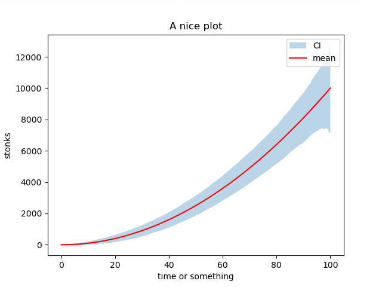

# stegaplots
Making plots while experimenting with an idea is very fun. Actually too much fun. 

Pretty soon you'll find yourself with a folder full of pretty plots, and no idea which set of parameters generated them.

Yeah, you could put the parameters in the name... but what if you have a lot of them? 
What if you would like to store the script itself along with that image?

Why not use [steganography](https://en.wikipedia.org/wiki/Steganography) to store all the data you want *INSIDE* the plot?


# Example : Save config
## Step 1: make plot + store data
```python
# experiment configuration
params = {"seed": 4, "n": 500, "sig": 1000}

# run experiment
np.random.seed(params["seed"])
xs = np.linspace(0, 100, params["n"])
ys = xs**2
upper = ys + np.sort(np.abs(np.random.randn(*ys.shape))) * params["sig"]
lower = ys - np.sort(np.abs(np.random.randn(*ys.shape))) * params["sig"]

# make plot
fig, ax = plt.subplots()
ax.fill_between(xs, upper, lower, alpha=0.3, label="CI")
ax.plot(xs, ys, color="red", label="mean")
ax.set_title("A nice plot")
ax.set_xlabel("time or something")
ax.set_ylabel("stonks")
ax.legend()
savefig_metadata_dict(fig, params, "./assets/encoded") # save the metadata IN the figure
plt.close()
```
Original                   |  Original + Parameters
:-------------------------:|:-------------------------:
   |  

## Step 2: retrieve parameters
```python
# retrieve information
retrieve_metadata("./assets/encoded-272.png")
> {"n": 500, "seed": 4, "sig": 1000}
```

# Example: save code
Even low quality images are quite roomy! Let's store the whole code of the tests
## Step 1: make plot + store code
```python
...
with open(__file__, "r") as f:
    code = f.read()
savefig_metadata(fig, code, "./assets/en_code") # save the metadata IN the figure
...
```

Original                   |  Original + Code
:-------------------------:|:-------------------------:
   |  

## Step 2: retrieve code
```python
# retrieve information
retrieve_metadata("./assets/en_code-9504.png")
> import json
> import unittest
> 
> import matplotlib.pyplot as plt
> import numpy as np
> ...

```
